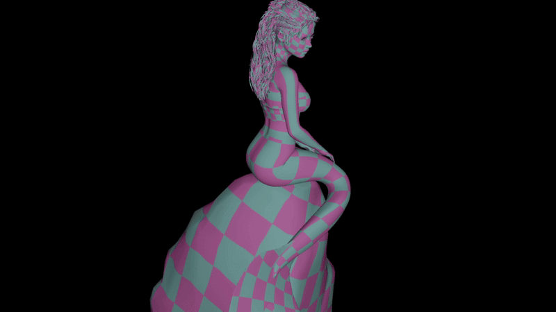

# OpenGL Depth Peeled Hair


Hair rendered with depth peeling, implemented in OpenGL. Should build off the rip in both Debug/Release.

```
git clone https://github.com/livinamuk/GLDepthPeeledHair.git
```

WSAD: movement<br>
Left ctrl: lower camera<br>
Space bar:  raise camera<br>
Q: Lower depth peel count<br>
E: Increase depth peel count<br>
Left shift: slow movement<br>
F: Toggle fullscreen<br>

I've also been using this repo as a playground to implement a new asset loading system, it's faster to write in here than in my main engine. 
It loads compressed dds files with embedded mipmaps asynchronously with alternating Pixel Buffer Objects, shown below:



Never quit, never waver 🌹
