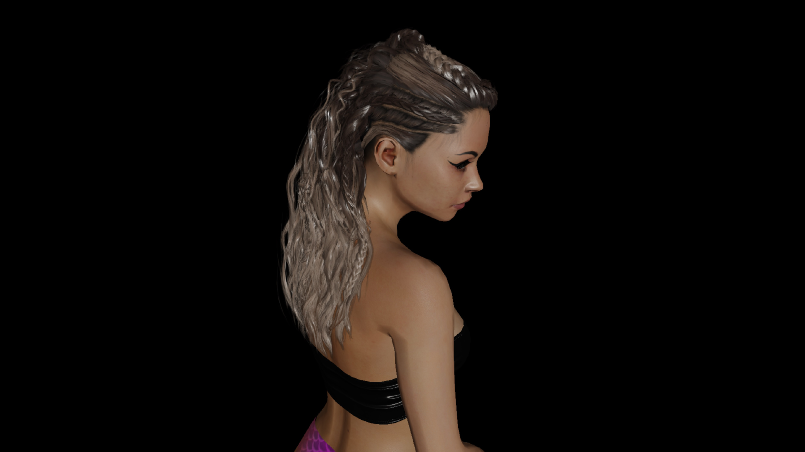

# OpenGL Depth Peeled Hair



Hair rendered with depth peeling, implemented in OpenGL. 

I've been using this repo as a playground to implement a new asset loading system too, it's faster to work in here than in my main engine. 
It loads compressed dds files with embedded mipmaps asynchronously with alternating Pixel Buffer Objects, should build off the rip in both Debug/Release.

<video width="640" height="360" controls>
  <source src="Video.mp4" type="video/mp4">
</video>

```
git clone https://github.com/livinamuk/GLDepthPeeledHair.git
```

WSAD: movement<br>
Left ctrl: lower camera<br>
Space bar:  raise camera<br>
Q: Lower depth peel count<br>
E: Increase depth peel count<br>
Left shift: slow movement<br>
F: Toggle fullscreen<br>

Never quit, never waver 🌹
